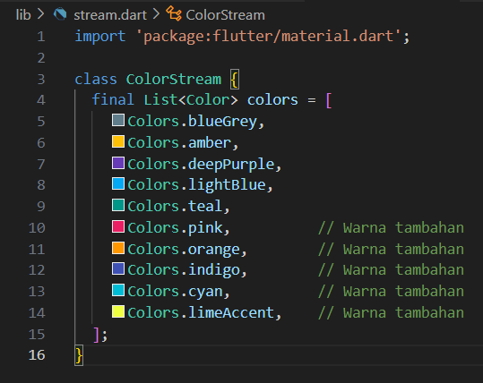

#### Soal 1
Tambahkan nama panggilan Anda pada title app sebagai identitas hasil pekerjaan Anda.
Gantilah warna tema aplikasi sesuai kesukaan Anda.
Lakukan commit hasil jawaban Soal 1 dengan pesan "W12: Jawaban Soal 1"


#### Soal 2
Tambahkan 5 warna lainnya sesuai keinginan Anda pada variabel colors tersebut.
Lakukan commit hasil jawaban Soal 2 dengan pesan "W12: Jawaban Soal 2"


#### Soal 3
Jelaskan fungsi keyword yield* pada kode tersebut!
Apa maksud isi perintah kode tersebut?
Lakukan commit hasil jawaban Soal 3 dengan pesan "W12: Jawaban Soal 3"

- yield* adalah keyword di Dart yang digunakan untuk meneruskan data dari satu stream (atau iterable) ke stream lainnya. Dalam konteks kode di atas, yield* digunakan untuk meneruskan hasil dari Stream.periodic ke dalam stream yang lebih besar, yaitu stream yang dihasilkan oleh method getColors().
Maksud Isi Perintah Kode:
Pada kode berikut:
``` dart
yield* Stream.periodic(
  const Duration(seconds: 1), (int t) {
    int index = t % colors.length;  // Menghitung index untuk sirkulasi warna
    return colors[index];  // Mengembalikan warna berdasarkan index
  },
);
```
Stream.periodic:

- Fungsi ini membuat stream yang mengeluarkan data secara berkala (periodik) setiap detik (dengan const Duration(seconds: 1)).
Setiap kali stream mengeluarkan data, parameter kedua (fungsi) dipanggil dengan parameter t, yang merupakan jumlah iterasi atau waktu dalam detik.
yield*:

- yield* digunakan untuk mengirimkan data yang dihasilkan oleh Stream.periodic ke stream yang lebih besar.
Dengan kata lain, yield* akan mengambil hasil dari stream yang dihasilkan oleh Stream.periodic dan mengirimkannya sebagai bagian dari stream yang dikembalikan oleh getColors().
Logika Perulangan:

- Fungsi (int t) menerima nilai t, yang menunjukkan waktu atau iterasi dalam detik.
int index = t % colors.length;: Modulus digunakan untuk memastikan bahwa ketika t melebihi panjang list colors, nilai index akan kembali ke awal (sirkulasi).
return colors[index];: Mengembalikan warna dari list colors berdasarkan indeks yang dihitung.

#### Soal 4
Capture hasil praktikum Anda berupa GIF dan lampirkan di README.
Lakukan commit hasil jawaban Soal 4 dengan pesan "W12: Jawaban Soal 4"


#### Soal 5
Jelaskan perbedaan menggunakan listen dan await for (langkah 9) !
Lakukan commit hasil jawaban Soal 5 dengan pesan "W12: Jawaban Soal 5"

1. await for:
- Penggunaan: await for digunakan dalam konteks asynchronous programming untuk mendengarkan stream di dalam sebuah method yang async. Ini akan menunggu (synchronously) setiap elemen yang dikirimkan dalam stream dan mengeksekusi kode setiap kali sebuah nilai baru diterima dari stream.
Blokir Eksekusi: Kode yang ada setelah await for tidak akan dijalankan sampai stream mengirimkan nilai berikutnya.
- Penghentian: Proses ini berhenti secara otomatis ketika stream selesai atau error terjadi, dan Anda bisa mengontrol kapan proses mendengarkan stream dihentikan jika diperlukan.

2. listen():
- Penggunaan: listen() adalah cara lain untuk mendengarkan stream, tetapi lebih fleksibel. Ia tidak memblokir eksekusi dan memungkinkan Anda untuk mendengarkan stream dalam mode callback. Anda bisa mengatur onData, onError, dan onDone untuk menangani data, kesalahan, dan selesai.
- Blokir Eksekusi: Tidak seperti await for, listen() tidak memblokir kode yang ada setelahnya. Program akan melanjutkan eksekusi meskipun masih mendengarkan stream.
- Penghentian: Anda bisa menghentikan stream kapan saja dengan memanggil cancel() pada objek StreamSubscription yang dikembalikan oleh listen().