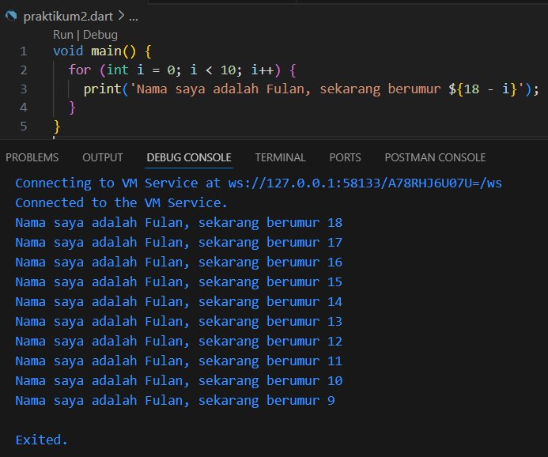

# Praktikum 2

### 2241720142
### Ridho Fauzian Pratama
### TI-3H / 21

## Soal 1
Modifikasilah kode pada baris 3 di VS Code atau Editor Code favorit Anda berikut ini agar mendapatkan keluaran (output) sesuai yang diminta!
```
void main() {
  for (int i = 0; i < 10; i++) {
    print('hello ${i + 2}');
  }
}
```
Output yang diminta:
```
Nama saya adalah Fulan, sekarang berumur 18
Nama saya adalah Fulan, sekarang berumur 17
Nama saya adalah Fulan, sekarang berumur 16
Nama saya adalah Fulan, sekarang berumur 15
Nama saya adalah Fulan, sekarang berumur 14
Nama saya adalah Fulan, sekarang berumur 13
Nama saya adalah Fulan, sekarang berumur 12
Nama saya adalah Fulan, sekarang berumur 11
Nama saya adalah Fulan, sekarang berumur 10
Nama saya adalah Fulan, sekarang berumur 9
```

## Soal 2
Mengapa sangat penting untuk memahami bahasa pemrograman Dart sebelum kita menggunakan framework Flutter ? Jelaskan!

## Soal 3
Rangkumlah materi dari codelab ini menjadi poin-poin penting yang dapat Anda gunakan untuk membantu proses pengembangan aplikasi mobile menggunakan framework Flutter.

# Jawaban 
## Soal 1


## Soal 2: Mengapa Penting Memahami Dart Sebelum Menggunakan Flutter?

Memahami bahasa pemrograman Dart sangat penting sebelum menggunakan framework Flutter karena beberapa alasan:

1. **Fundamental Flutter**: Flutter menggunakan Dart sebagai bahasa pemrogramannya. Semua fungsi, widget, dan integrasi yang dibuat dalam Flutter dibangun menggunakan Dart. Oleh karena itu, pemahaman yang baik tentang Dart diperlukan untuk menggunakan Flutter secara efektif.
2. **Efisiensi Pengembangan**: Memahami Dart memungkinkan pengembang untuk menulis kode yang lebih bersih, lebih efisien, dan lebih mudah untuk dipelihara. Ini termasuk memahami asinkronisitas yang merupakan bagian penting dari Dart untuk menangani operasi I/O tanpa menghambat UI.
3. **Optimalisasi Aplikasi**: Dart menyediakan fitur-fitur modern seperti hot reload yang sangat membantu dalam pengembangan aplikasi dengan Flutter, memungkinkan perubahan kode cepat dan melihat hasilnya hampir secara instan tanpa perlu restart aplikasi.
4. **Komunitas dan Sumber Daya**: Dart adalah bahasa yang matang dengan komunitas yang besar. Sebagai pengembang Flutter, memahami Dart membuka akses ke sumber daya, alat, dan dukungan komunitas yang luas.
5. **Manajemen Memori dan Performa**: Dart mengelola memori secara otomatis melalui garbage collection, yang penting untuk pengembangan mobile agar aplikasi tetap responsif dan efisien. Memahami cara kerja ini dapat membantu dalam mengoptimalkan performa aplikasi.

## Soal 3: Point-Point Penting dari Codelab Flutter

Berikut adalah beberapa point penting yang bisa diambil dari codelab dalam pengembangan aplikasi mobile menggunakan Flutter:

1. **Setup dan Konfigurasi Lingkungan**: Memastikan bahwa semua alat pengembangan terinstall dengan benar, termasuk Flutter SDK dan editor yang mendukung Flutter seperti Android Studio atau Visual Studio Code.
2. **Pengenalan Dasar Flutter**: Memahami struktur dasar aplikasi Flutter, termasuk widgets, dan cara mereka digunakan untuk membangun UI.
3. **Pengelolaan State**: Belajar mengelola state dalam aplikasi, yang adalah kunci untuk membangun aplikasi yang interaktif dan responsif.
4. **Navigasi dan Routing**: Memahami cara navigasi dan routing bekerja di Flutter, yang penting untuk aplikasi multi-halaman.
5. **Integrasi API dan Networking**: Cara melakukan networking di Flutter, seperti mengambil data dari internet.
6. **Database dan Penyimpanan Lokal**: Implementasi penyimpanan lokal menggunakan SQLite atau penyimpanan key-value seperti shared_preferences.
7. **Testing**: Pengenalan ke testing di Flutter, untuk memastikan bahwa aplikasi bekerja seperti yang diharapkan sebelum diluncurkan.
8. **Deploy dan Release**: Memahami proses untuk mengemas dan merilis aplikasi ke Google Play Store atau Apple App Store.

Memahami dan menerapkan point-point ini akan sangat membantu dalam mengembangkan aplikasi yang efektif dan efisien menggunakan Flutter.