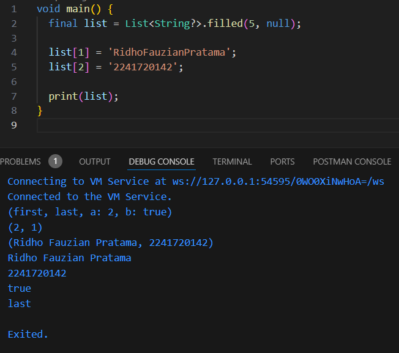
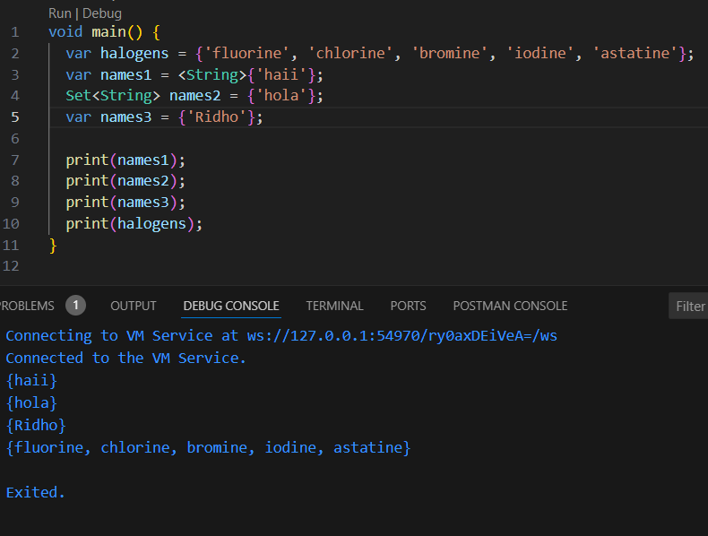
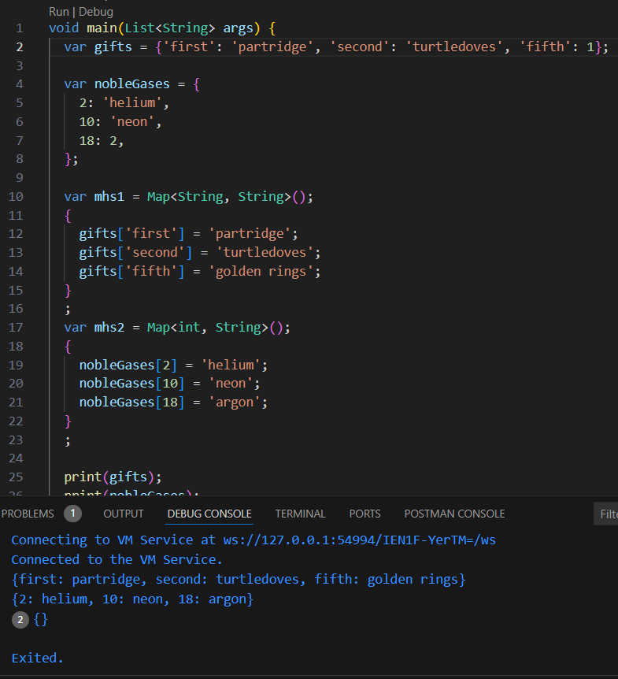
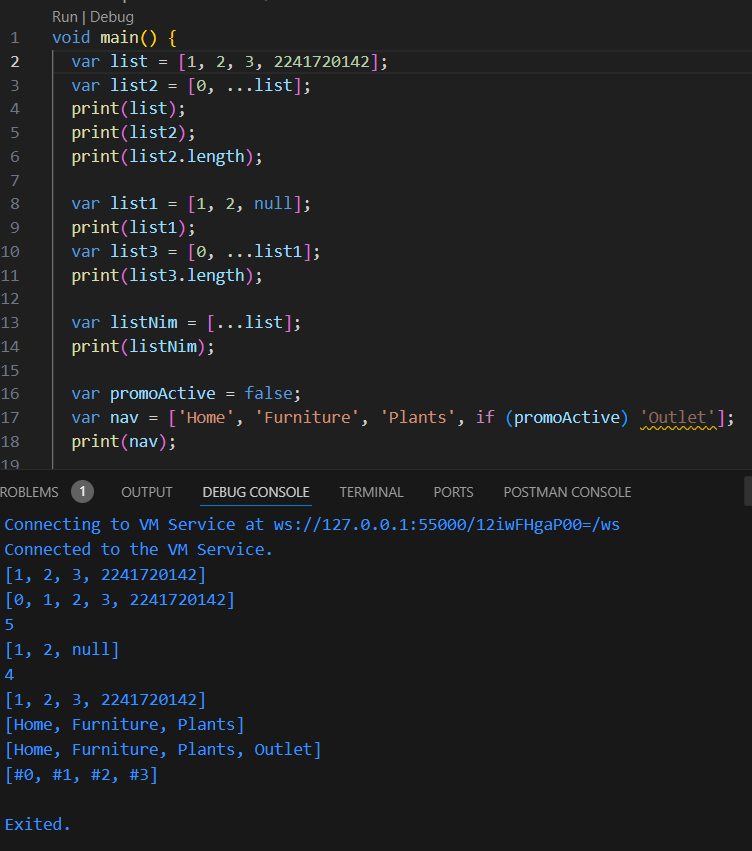
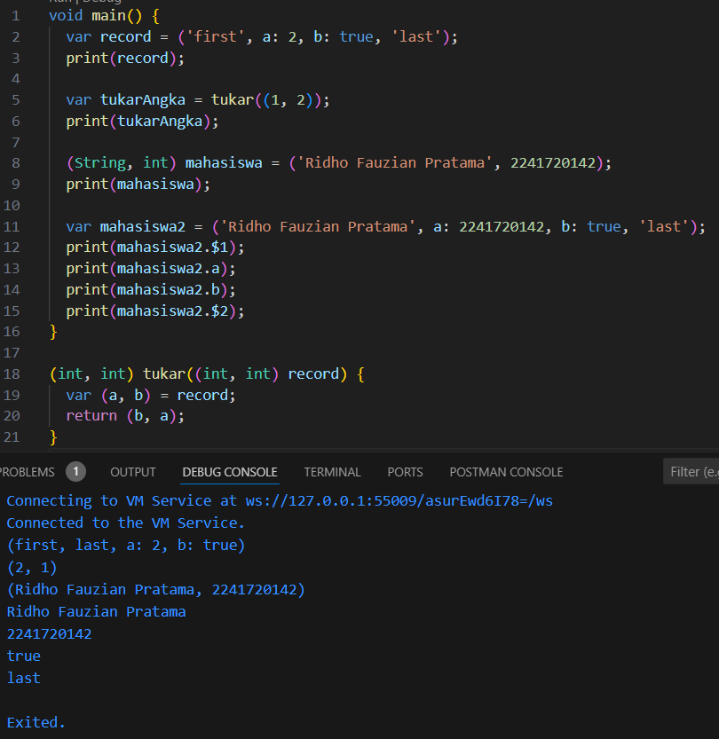

## Ridho Fauzian Pratama
## 2241720142
## TI-3H / 21

### Tugas Praktikum

1. Silakan selesaikan Praktikum 1 sampai 5, lalu dokumentasikan berupa screenshot hasil pekerjaan Anda beserta penjelasannya!

### Praktikum 1

 Penjelasan :
Membuat list dengan panjang 5 dan nilai default null lalu Mengisi indeks ke-1 dan ke-2 dengan nama dan NIM sebagai string Nama dan NIM sebagai string

### Praktikum 2

· Set di Dart:
Set adalah kumpulan item yang unik dan tidak berurutan, ditulis dengan {}.
var names1 = {'haii'}: Mendeklarasikan set dengan tipe String.
Set names2 = {'hola'}: Cara lain untuk mendeklarasikan set dengan tipe String.
var names3 = {'farrel'}: Ini membuat map, bukan set, karena Dart mengira kamu membuat map jika tidak jelas tipe datanya. 

### Praktikum 3

 · Map di Dart:
Map adalah koleksi pasangan kunci-nilai, juga ditulis dengan {}, tetapi dengan format {'kunci': 'nilai'}.

 Kode ini menggunakan Map di Dart untuk menyimpan data dalam bentuk pasangan kunci-nilai.

 gifts: Map dengan kunci berupa String dan nilai campuran (bisa String atau int). Nilai kunci 'fifth' diubah dari 1 menjadi 'golden rings'.
nobleGases: Map dengan kunci int dan nilai campuran. Nilai kunci 18 diubah dari 2 menjadi 'argon'.
mhs1 dan mhs2: Map kosong yang didefinisikan dengan tipe kunci dan nilai tertentu, tapi tidak diisi dengan data.

### Praktikum 4

 Penjelasan : Pada kode tersebut kita melakukan inisialisasi listOfInts dengan value [1, 2, 3] dan melakukan inisialisasi untuk variable listOfStrings dengan value ['#0', for(var i in listOfInts) '#$i'] maksud dari syntax tersebut yaitu dart akan melakukan looping terhadap variable listOfInts yang kemudian akan mengambil value dari array listOfInts. Selanjutnya memasukkan variable i tersebut ke dalam sebuah string dan menampilkan variable listOfStrings.

### Praktikum 5

 Penjelasan :  
Pada kode tersebut kita melakukan inisialisasi variabel mahasiswa2 yang diisi valuenya menggunakan record. Kemudian menampilkan isi data pada variable record dengan memanggil keynya dan urutan index pada record untuk string.

2. Jelaskan yang dimaksud Functions dalam bahasa Dart!

 Jawaban :  
Function merupakan sebuah syntax kode yang dapat digunakan kembali tergantung dengan kegunaan pada functionnya. contoh function pada dart seperti di bawah ini :

3. Jelaskan jenis-jenis parameter di Functions beserta contoh sintaksnya!

 Jawaban :  
Pada dart terdapat 3 jenis parameter, antara lain : 
Parameter Wajib Parameter wajib adalah parameter yang harus diberikan nilai saat function dipanggil dan jika tidak memberikan nilai ketika dipanggil akan terjadi error. 
Parameter Opsional Parameter opsional adalah parameter yang tidak harus diberikan nilai ketika dilakukan pemanggilan function. Pada parameter opsional terdapat dua jenis yaitu named parameter dan positional parameter.

4. Jelaskan maksud Functions sebagai first-class objects beserta contoh sintaknya!

 Jawaban :  
Maksud dari function sebagai first-class objects bahwa function bisa diperlakukan seperti menggunakan objek biasa.

5. Apa itu Anonymous Functions? Jelaskan dan berikan contohnya!

 Jawaban :  
Anonymous functions adalah function yang tidak memiliki sebuah nama. Biasanya function ini digunakan untuk argumen pada function lain atau sebagai callback.

6. Jelaskan perbedaan Lexical scope dan Lexical closures! Berikan contohnya!

 Jawaban : 
Lexical Scope Lexical scope adalah lingkup variable ditentukan oleh posisi variabel tersebut dalam source code. Maksudnya jika ada variable yang dilakukan deklarasi pada function salam maka hanya bisa menggunakan variable tersebut di function salam saja dan tidak bisa dipanggil pada function lain. 
Lexical Closure Lexical closure adalah function yang menutup lingkup dimana mereka di deklarasi. Maksudnya adalah closure bisa mengakses variable dari lingkup luar bahkan setelah selesai dilakukan eksekusi.

7. Jelaskan dengan contoh cara membuat return multiple value di Functions!

 Jawaban :  
Untuk melakukan return multiple value pada function kita bisa menggunakan list, map, record, dan class untuk membuatnya.